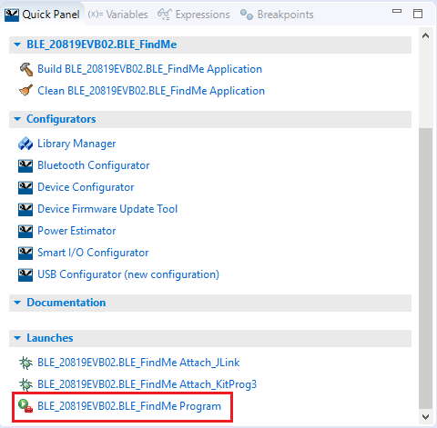
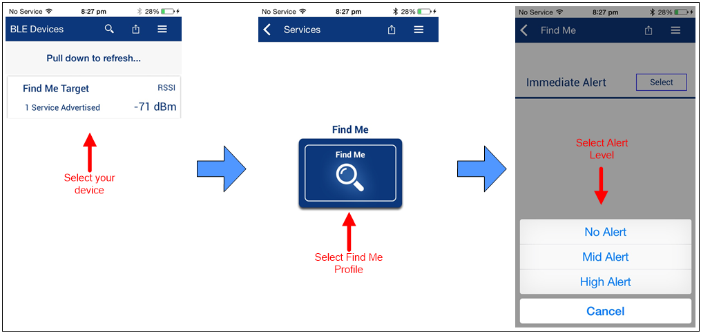
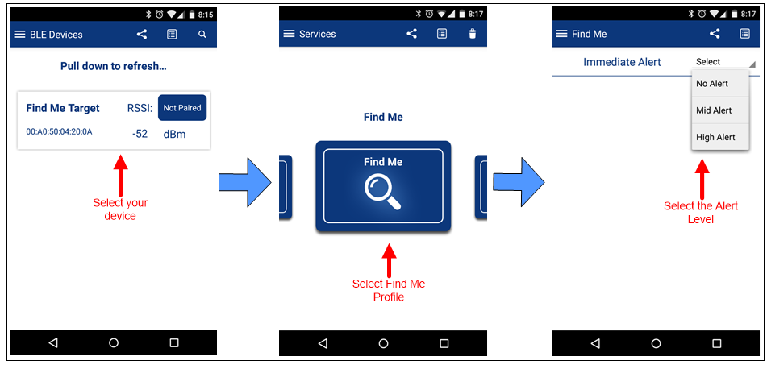
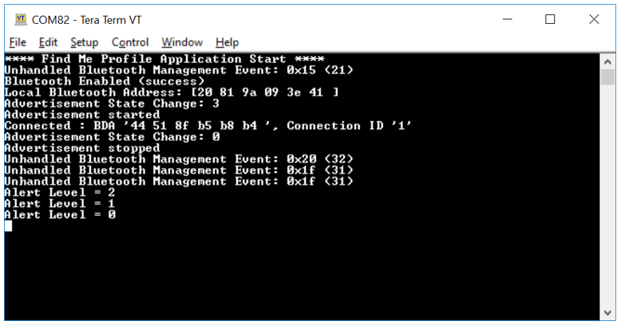
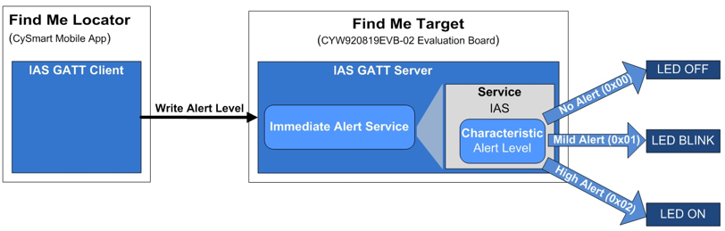

# CE226123 - BLE FindMe

This code example demonstrates the implementation of a simple BLE Immediate Alert Service (IAS)-based Find Me Profile (FMP) using the Cypress Bluetooth SoCs and ModusToolbox™ Integrated Development Environment (IDE).
This document uses CYW20819 as the reference, but the example and instructions in this document are applicable for all supported kits. See the `makefile` file in the *example* folder for a detailed list of supported devices.

## Requirements
- **Tool**: [ModusToolbox™ IDE](https://www.cypress.com/products/modustoolbox-software-environment) v2.0

- **Programming Language**: C

- **Associated Parts**: [CYW20819](https://www.cypress.com/datasheet/CYW20819), [CYW20820](https://www.cypress.com/datasheet/CYW20820), [CYW20719](https://www.cypress.com/documentation/datasheets/cyw20719-enhanced-low-power-bredrble-bluetooth-50-soc)

## Supported Kits
- [CYW920819EVB-02 Evaluation Kit](http://www.cypress.com/CYW920819EVB-02)
- [CYW920820EVB-02 Evaluation kit](http://www.cypress.com/CYW920820EVB-02)
- [CYW920719B2Q40EVB-01 Evaluation kit](https://community.cypress.com/docs/DOC-17736)

See the `makefile` file for a detailed list of supported kits.

## Hardware Setup
This example uses the kit’s default configuration. Refer to the [kit guide](http://www.cypress.com/CYW920819EVB-02), if required, to ensure the kit is configured correctly.

## Software Setup
This code example consists of two parts: a locator and a target.

For the locator, download and install the CySmart™ app for [iOS](https://itunes.apple.com/us/app/cysmart/id928939093?mt=8) or [Android](https://play.google.com/store/apps/details?id=com.cypress.cysmart&hl=en).

You can also use the [CySmart Host Emulation Tool](http://www.cypress.com/go/cysmart) Windows PC application if you have access to the [CY5677 CySmart BLE 4.2 USB Dongle](http://www.cypress.com/documentation/development-kitsboards/cy5677-cysmart-bluetooth-low-energy-ble-42-usb-dongle). You can also use other Android or iOS apps that support the IAS service.

Scan the following QR codes from your mobile phone to download the CySmart app.

## Using the Code Example

Refer to the `README` file in the root of the repo for instruction on how to build and program the code example using ModusToolBox IDE and CLI.

## Operation
1. Connect the kit to your PC using the provided USB cable.

   The USB Serial interface on the kit provides access to the two UART interfaces of the CYW20819 device – WICED HCI UART and WICED Peripheral UART (PUART). The HCI UART is used only for downloading the application code in this code example; PUART is for printing the Bluetooth stack and application trace messages.
2. Use your favorite serial terminal application and connect to the PUART serial port. Configure the terminal application to access the serial port using the following settings.
   Baud rate : 115200 bps; Data: 8 bits; Parity : None; Stop : 1 bit; Flow control : None; New line for receive data : Line Feed(LF) or Auto setting

3. Import the code example into a new or existing workspace. See [Importing Code Example into ModusToolbox IDE - KBA225201](https://community.cypress.com/docs/DOC-15968) for details.

4.	Build and program the application: In the project explorer, select the project. The Quick Panel will get populated with various options. Scroll to the **Launches** section, and click the **Program configuration** link as shown in [Figure 1]().

##### Figure 1 Quick Panel with Program Configuration

  **Note:** If the download fails, it is possible that a previously loaded application is preventing programming. For example, the application may use a custom baud rate that the download process does not detect, or the device may be in a low-power mode. In that case, it may be necessary to put the board in recovery mode, and then try the programming operation again from the IDE.
 
  To enter recovery mode, first, press and hold the Recover button (SW1), then press the Reset button (SW2), release the Reset button (SW2), and then release the Recover button (SW1).

5.	Observe the yellow LED (LED1) starts blinking after the device starts advertising.

6.	To test using the CySmart mobile app, do the following (see equivalent CySmart app screenshots in [Figure 2](#figure-2-testing-with-the-cysmart-app-on-ios) and [Figure 3](#figure-3-testing-with-the-cysmart-app-on-android)):
 
    1. Turn ON Bluetooth on your Android or iOS device.

    2. Launch the CySmart app.
 
    3. Press the reset switch on the CYW920819EVB-02 kit to start sending advertisements. The yellow LED (LED1) starts blinking to indicate that advertising has started. Advertising will stop after 90 seconds if a connection has not been established.

    4. Swipe down on the CySmart app home screen to start scanning for BLE Peripherals; your device (“Find Me Target”) appears in the CySmart app home screen. Select your device to establish a BLE connection. Once the connection is established, the yellow LED (LED1) changes from blinking state to always ON state.
 
    5. Select the 'Find Me' Profile from the carousel view.
 
    6. Select an Alert Level value on the Find Me Profile screen. Observe the state of the red LED (LED2) on the device changes based on the alert level.

[Figure 2](#figure-2-testing-with-the-cysmart-app-on-ios) and [Figure 3](#figure-3-testing-with-the-cysmart-app-on-android) show the steps for using CySmart App on iOS and Android respectively.

##### Figure 2. Testing with the CySmart App on iOS

##### Figure 3. Testing with the CySmart App on Android

7.	Use the PUART serial port to view the Bluetooth stack and application trace messages in the terminal window as shown in [Figure 4]().

##### Figure 4. Log Messages on WICED PUART COM Port

## Design and Implementation
The ‘Find Me Locator’ (the BLE Central device) is a BLE GATT Client. The ‘Find Me Target’ (the Peripheral device) is a BLE GATT Server with the IAS implemented, as [Figure 5]() shows.

##### Figure 5. Find Me profile (FMP) Implementation on CYW20819

The BLE Find Me profile defines what happens when the locating Central device broadcasts a change in the alert level.

The Find Me locator performs service discovery using the "GATT Discover All Primary Services" procedure. The BLE Service Characteristic discovery is done by the "Discover All Characteristics of a Service" procedure. When the Find Me Locator wants to cause an alert on the Find Me Target, it writes an alert level in the Alert Level Characteristic of the IAS. When the Find Me Target receives an alert level, it indicates the level using the red LED: OFF for no alert, blinking for mild alert, and ON for high alert.

The application code and Bluetooth stack runs on the Arm® Cortex®-M4 core of the CYW20819 SoC. The important source files relevant for the user application level code for this code example are listed in [Table 1]().

##### Table 1. Important User-Application-Related Source Files

|**File Name**|**Comments**|
|-----------------------------------|-------------------------------------------------------|
|*main.c* | Contains the `application_start()` function, which is the entry point for execution of the user application code after device startup.|
|*app_bt_cfg.c, app_bt_cfg.h* |	These files contain the runtime Bluetooth stack configuration parameters such as device name and  advertisement/ connection settings. Note that the name that the device uses for advertising (“Find Me Target”) is defined in *app_bt_cfg.c*.|
|*app_bt_event_handler.c, app_bt_event_handler.h*|These files contain the code for the Bluetooth stack event handler functions. |
|app_user_interface.c, app_user_interface.h*	|These files contain the code for the application user interface (in this case, the LED) functionality.|
|*cycfg_gatt_db.c, cycfg_gatt_db.h*|	These files reside in the *GeneratedSource* folder under the application folder. They contain the GATT database information generated using the Bluetooth Configurator tool.|

See [AN225684 – Getting Started with CYW208xx](http://www.cypress.com/an225684) application note to understand the firmware design for this code example.

## Resources and Settings
This section explains the ModusToolbox resources and their configuration as used in this code example. Note that all the configuration explained in this section has already been done in the code example. The ModusToolbox IDE stores the configuration settings of the application in the *design.modus* file. This file is used by the graphical configurators, which generate the configuration firmware. This firmware is stored in the application’s *GeneratedSource* folder.

- **Device Configurator:** The Device Configurator is used to enable/configure the peripherals and the pins used in the application. For detailed information on how to use it, see
[Device Configurator Guide](https://www.cypress.com/ModusToolboxDeviceConfig).

- **Bluetooth Configurator:** The Bluetooth Configurator is used for generating/modifying the BLE GATT database. For detailed information on how to use it, see
[Bluetooth Configurator Guide](https://www.cypress.com/ModusToolboxBLEConfig).

## Related Resources

| **Application Notes**                                            |                                                              |
| :----------------------------------------------------------- | :----------------------------------------------------------- |
|[AN225684 – Getting Started with CYW208xx](http://www.cypress.com/an225684) | Describes CYW20819, CYW20820 Bluetooth SoC, software/hardware development ecosystem, and how to build your first BLE application using the device in ModusToolbox IDE.
| **Code Examples**  |
|Visit the BTSDK code examples repository in Cypress GitHub portal for a comprehensive collection of code examples using ModusToolbox IDE|
|**Device Documentation**|
|[CYW20819 Device Datasheet](https://www.cypress.com/datasheet/CYW20819)|
|[CYW20820 Device Datasheet](https://www.cypress.com/datasheet/CYW20820)|
|[CYW20719 Device Datasheet](https://www.cypress.com/documentation/datasheets/cyw20719-enhanced-low-power-bredrble-bluetooth-50-soc)|
|**Development Kits** |
|[CYW920819EVB-02 Evaluation Kit](http://www.cypress.com/CYW920819EVB-02)|
|[CYW920820EVB-02 Evaluation Kit](http://www.cypress.com/CYW920820EVB-02)|
|[CYW920719B2Q40EVB-01 Evaluation kit](https://community.cypress.com/docs/DOC-17736)|
|**Tool Documentation** |
|[ModusToolbox IDE](http://www.cypress.com/modustoolbox)| The Cypress IDE for IoT designers|
--------------------------------------------------------------------------------------------

## Common application settings

Application settings below are common for all BTSDK applications and can be configured via the makefile of the application or passed in via the command line.

**BT\_DEVICE\_ADDRESS**
> Set the BDA (Bluetooth Device Address) for your device. The address is 6 bytes, for example, 20819A10FFEE. By default, the SDK will set a BDA for your device by combining the 7 hex digit device ID with the last 5 hex digits of the host PC MAC address.

**UART**
> Set to the UART port you want to use to download the application. For example 'COM6' on Windows or '/dev/ttyWICED\_HCI\_UART0' on Linux or '/dev/tty.usbserial-000154' on macOS. By default, the SDK will auto-detect the port.

**ENABLE_DEBUG**
> For HW debugging, configure ENABLE\_DEBUG=1. See the document [WICED-Hardware-Debugging](https://github.com/cypresssemiconductorco/btsdk-docs/blob/master/docs/BT-SDK/WICED-Hardware-Debugging.pdf) for more information. This setting configures GPIO for SWD. 
>
   - CYW920819EVB-02/CYW920820EVB-02: SWD signals are shared with D4 and D5, see SW9 in schematics.
   - CYBT-213043-MESH/CYBT-213043-EVAL/CYBT-243053-EVAL/CYBT-253059-EVAL/CYBT-253059-EVAL: SWD signals are routed to P12=SWDCK and P13=SWDIO. Use expansion connectors to connect VDD, GND, SWDCK, and SWDIO to your SWD Debugger probe.
   - CYBT-223058-EVAL/CYBT-243053-EVAL/CYW920835M2EVB-01: SWD signals are routed to P02=SWDCK and P03=SWDIO. Use expansion connectors to connect VDD, GND, SWDCK, and SWDIO to your SWD Debugger probe.
   - CYBT-263065-EVAL/CYBT-273063-EVAL: SWD signals are routed to P02=SWDCK and P04=SWDIO. Use expansion connectors to connect VDD, GND, SWDCK, and SWDIO to your SWD Debugger probe.
   - CYBT-343026-EVAL/CYBT-353027-EVAL: SWD signals are routed to P11=SWDCK and P15=SWDIO. Use expansion connectors to connect VDD, GND, SWDCK, and SWDIO to your SWD Debugger probe.
   - CYBT-343052-EVAL: SWD signals are routed to P02=SWDCK and P03=SWDIO. Use expansion connectors to connect VDD, GND, SWDCK, and SWDIO to your SWD Debugger probe.
   - CYBT-413055-EVAL/CYBT-413061-EVAL: SWD signals are routed to P16=SWDCK and P17=SWDIO. Use expansion connectors to connect VDD, GND, SWDCK, and SWDIO to your SWD Debugger probe.
   - CYW989820EVB-01: SWDCK (P02) is routed to the J13 DEBUG connector, but not SWDIO. Add a wire from J10 pin 3 (PUART CTS) to J13 pin 2 to connect GPIO P10 to SWDIO.
   - CYW920719B2Q40EVB-01: PUART RX/TX signals are shared with SWDCK and SWDIO. Remove RX and TX jumpers on J10 when using SWD. PUART and SWD cannot be used simultaneously on this board unless these pins are changed from the default configuration.
   - CYW920721B2EVK-02: SWD signals are shared with D4 and D5, see SW9 in schematics.
   - CYW920721M2EVK-02: The default setup uses P03 for SWDIO and P05 for SWDCK. Check the position of SW15 if using JLink with the DEBUG connector.
   - CYW920706WCDEVAL: SWD debugging requires fly-wire connections. The default setup P15 (J22 pin 3 or J24 pin 1) for SWDIO and P11 (J23 pin 5
    or J22 pin 4) for SWDCK.
   - CYW920735Q60EVB-01: SWD hardware debugging supported. The default setup uses the J13 debug header, P3 (J13 pin 2) for SWDIO and P2 (J13 pin 4) for SWDCK.  They can be optionally routed to D4 and D4 on the Arduino header J4, see SW9 in schematics.
   - SWD hardware debugging is not supported on the following:
   >- CYW920721M2EVK-01
   >- CYW920835REF-RCU-01
   >- CYW920819REF-KB-01
   >- CYW9M2BASE-43012BT
   >- CYW943012BTEVK-01
   >- CYBT-423054-EVAL
   >- CYBT-423060-EVAL
   >- CYBT-483056-EVAL
   >- CYBT-483062-EVAL

## Building code examples

**Using the ModusToolbox IDE**

1. Install ModusToolbox 2.2 (or higher).
2. In the ModusToolbox IDE, click the **New Application** link in the Quick Panel (or, use **File > New > ModusToolbox IDE Application**).
3. Pick your board for BTSDK under AIROC Bluetooth BSPs.
4. Select the application in the IDE.
5. In the Quick Panel, select **Build** to build the application.
6. To program the board (download the application), select **Program** in the Launches section of the Quick Panel.

**Using command line**

1. Install ModusToolbox 2.2 (or higher).
2. On Windows, use Cygwin from \ModusToolbox\tools_2.x\modus-shell\Cygwin.bat to build apps.
3. Use the tool 'project-creator-cli' under \ModusToolbox\tools_2.x\project-creator\ to create your application. 
   > project-creator-cli --board-id (BSP) --app-id (appid) -d (dir)  
   See 'project-creator-cli --help' for useful options to list all available BSPs, and all available apps per BSP. 
   For example: 
   > project-creator-cli --app-id mtb-example-btsdk-empty --board-id CYW920706WCDEVAL -d . 
4. To build the app call make build. For example: 
   > cd mtb-examples-btsdk-empty 
   > make build 
5. To program (download to) the board, call: 
   > make qprogram 
6. To build and program (download to) the board, call: 
   > make program  
   Note: make program = make build + make qprogram

## Downloading an application to a board

If you have issues downloading to the board, follow the steps below:

- Press and hold the 'Recover' button on the board.
- Press and hold the 'Reset' button on the board.
- Release the 'Reset' button.
- After one second, release the 'Recover' button.

Note: this is only applicable to boards that download application images to FLASH storage. Boards that only support RAM download (DIRECT_LOAD) such as CYW9M2BASE-43012BT can be power cycled to boot from ROM.

## Over The Air (OTA) Firmware Upgrade
Applications that support OTA upgrade can be updated via the peer OTA app in: 
>\<Workspace Dir>\mtb\_shared\wiced\_btsdk\tools\btsdk-peer-apps-ota 

See the readme.txt file located in the above folder for instructions. 
To generate the OTA image for the app, configure OTA\_FW\_UPGRADE=1 in the app
makefile, or append OTA\_FW\_UPGRADE=1 to a build command line, for example:
> make PLATFORM=CYW955572BTEVK-01 OTA\_FW\_UPGRADE=1 build 

This will the generate \<app>.bin file in the 'build' folder.

## SDK software features

- Dual-mode Bluetooth stack included in the ROM (BR/EDR and LE)
- Bluetooth stack and profile level APIs for embedded Bluetooth application development
- WICED HCI protocol to simplify host/MCU application development
- APIs and drivers to access on-board peripherals
- Bluetooth protocols include GAP, GATT, SMP, RFCOMM, SDP, AVDT/AVCT, LE Mesh
- LE and BR/EDR profile APIs, libraries, and sample apps
- Support for Over-The-Air (OTA) upgrade
- Device Configurator for creating custom pin mapping
- Bluetooth Configurator for creating LE GATT Database
- Peer apps based on Android, iOS, Windows, etc. for testing and reference
- Utilities for protocol tracing, manufacturing testing, etc.
- Documentation for APIs, datasheets, profiles, and features
- BR/EDR profiles: A2DP, AVRCP, HFP, HSP, HID, SPP, MAP, PBAP, OPP
- LE profiles: Mesh profiles, HOGP, ANP, BAP, HRP, FMP, IAS, ESP, LE COC
- Apple support: Apple Media Service (AMS), Apple Notification Center Service (ANCS), iBeacon, Homekit, iAP2
- Google support: Google Fast Pair Service (GFPS), Eddystone
- Amazon support: Alexa Mobile Accessories (AMA)

Note: this is a list of all features and profiles supported in BTSDK, but some AIROC devices may only support a subset of this list.

## List of boards available for use with BTSDK

- [CYW20819A1 chip](https://github.com/cypresssemiconductorco/20819A1)
    - [CYW920819EVB-02](https://github.com/cypresssemiconductorco/TARGET_CYW920819EVB-02), [CYBT-213043-MESH](https://github.com/cypresssemiconductorco/TARGET_CYBT-213043-MESH), [CYBT-213043-EVAL](https://github.com/cypresssemiconductorco/TARGET_CYBT-213043-EVAL), [CYW920819REF-KB-01](https://github.com/cypresssemiconductorco/TARGET_CYW920819REF-KB-01), [CYBT-223058-EVAL](https://github.com/cypresssemiconductorco/TARGET_CYBT-223058-EVAL), [CYBT-263065-EVAL](https://github.com/cypresssemiconductorco/TARGET_CYBT-263065-EVAL), [CYBT-273063-EVAL](https://github.com/cypresssemiconductorco/TARGET_CYBT-273063-EVAL)
- [CYW20820A1 chip](https://github.com/cypresssemiconductorco/20820A1)
    - [CYW920820EVB-02](https://github.com/cypresssemiconductorco/TARGET_CYW920820EVB-02), [CYW989820EVB-01](https://github.com/cypresssemiconductorco/TARGET_CYW989820EVB-01), [CYBT-243053-EVAL](https://github.com/cypresssemiconductorco/TARGET_CYBT-243053-EVAL), [CYBT-253059-EVAL](https://github.com/cypresssemiconductorco/TARGET_CYBT-253059-EVAL)
- [CYW20721B2 chip](https://github.com/cypresssemiconductorco/20721B2)
    - [CYW920721B2EVK-02](https://github.com/cypresssemiconductorco/TARGET_CYW920721B2EVK-02), [CYW920721M2EVK-01](https://github.com/cypresssemiconductorco/TARGET_CYW920721M2EVK-01), [CYW920721M2EVK-02](https://github.com/cypresssemiconductorco/TARGET_CYW920721M2EVK-02), [CYBT-423060-EVAL](https://github.com/cypresssemiconductorco/TARGET_CYBT-423060-EVAL), [CYBT-483062-EVAL](https://github.com/cypresssemiconductorco/TARGET_CYBT-483062-EVAL), [CYBT-413061-EVAL](https://github.com/cypresssemiconductorco/TARGET_CYBT-413061-EVAL)
- [CYW20719B2 chip](https://github.com/cypresssemiconductorco/20719B2)
    - [CYW920719B2Q40EVB-01](https://github.com/cypresssemiconductorco/TARGET_CYW920719B2Q40EVB-01), [CYBT-423054-EVAL](https://github.com/cypresssemiconductorco/TARGET_CYBT-423054-EVAL), [CYBT-413055-EVAL](https://github.com/cypresssemiconductorco/TARGET_CYBT-413055-EVAL), [CYBT-483056-EVAL](https://github.com/cypresssemiconductorco/TARGET_CYBT-483056-EVAL)
- [CYW20706A2 chip](https://github.com/cypresssemiconductorco/20706A2)
    - [CYW920706WCDEVAL](https://github.com/cypresssemiconductorco/TARGET_CYW920706WCDEVAL), [CYBT-353027-EVAL](https://github.com/cypresssemiconductorco/TARGET_CYBT-353027-EVAL), [CYBT-343026-EVAL](https://github.com/cypresssemiconductorco/TARGET_CYBT-343026-EVAL)
- [CYW20735B1 chip](https://github.com/cypresssemiconductorco/20735B1)
    - [CYW920735Q60EVB-01](https://github.com/cypresssemiconductorco/TARGET_CYW920735Q60EVB-01), [CYBT-343052-EVAL](https://github.com/cypresssemiconductorco/TARGET_CYBT-343052-EVAL)
- [CYW20835B1 chip](https://github.com/cypresssemiconductorco/20835B1)
    - [CYW920835REF-RCU-01](https://github.com/cypresssemiconductorco/TARGET_CYW920835REF-RCU-01), [CYW920835M2EVB-01](https://github.com/cypresssemiconductorco/TARGET_CYW920835M2EVB-01)
- [CYW43012C0 chip](https://github.com/cypresssemiconductorco/43012C0)
    - [CYW9M2BASE-43012BT](https://github.com/cypresssemiconductorco/TARGET_CYW9M2BASE-43012BT), [CYW943012BTEVK-01](https://github.com/cypresssemiconductorco/TARGET_CYW943012BTEVK-01)

## Folder structure

All BTSDK code examples need the 'mtb\_shared\wiced\_btsdk' folder to build and test the apps. 'wiced\_btsdk' includes the 'dev-kit' and 'tools' folders. The contents of the 'wiced\_btsdk' folder will be automatically populated incrementally as needed by the application being used.

**dev-kit**

This folder contains the files that are needed to build the embedded Bluetooth apps.

* baselib: Files for chips supported by BTSDK. For example CYW20819, CYW20719, CYW20706, etc.

* bsp: Files for BSPs (platforms) supported by BTSDK. For example CYW920819EVB-02, CYW920721B2EVK-02, CYW920706WCDEVAL etc.

* btsdk-include: Common header files needed by all apps and libraries.

* btsdk-tools: Build tools needed by BTSDK.

* libraries: Profile libraries used by BTSDK apps such as audio, LE, HID, etc.

**tools**

This folder contains tools and utilities need to test the embedded Bluetooth apps.

* btsdk-host-apps-bt-ble: Host apps (Client Control) for LE and BR/EDR embedded apps, demonstrates the use of WICED HCI protocol to control embedded apps.

* btsdk-host-peer-apps-mesh: Host apps (Client Control) and Peer apps for embedded Mesh apps, demonstrates the use of WICED HCI protocol to control embedded apps, and configuration and provisioning from peer devices.

* btsdk-peer-apps-ble: Peer apps for embedded LE apps.

* btsdk-peer-apps-ota: Peer apps for embedded apps that support Over The Air Firmware Upgrade.

* btsdk-utils: Utilities used in BTSDK such as BTSpy, wmbt, and ecdsa256.

See README.md in the sub-folders for more information.

## Software Tools
The following tool applications are installed on your computer either with ModusToolbox, or by creating an application in the workspace that can use the tool.

**BT Spy:** 
>   BTSpy is a trace viewer utility that can be used with WICED BT platforms to
    view protocol and application trace messages from the embedded device. The
    utility is located in the folder below. For more information, see readme.txt in the same folder. 
    This utility can be run directly from the filesystem, or it can be run from
    the Tools section of the ModusToolbox IDE QuickPanel, or by right-clicking
    a project in the IDE Project Explorer pane and selecting the ModusToolbox
    context menu. 
    It is supported on Windows, Linux and macOS. 
    Location:  \<Workspace Dir>\wiced_btsdk\tools\btsdk-utils\BTSpy

**BT/LE Profile Client Control:** 
>   This application emulates host MCU applications for LE and BR/EDR profiles.
    It demonstrates WICED BT APIs. The application communicates with embedded
    apps over the WICED HCI interface. The application is located in the folder
    below. For more information, see readme.txt in the same folder. 
    This utility can be run directly from the filesystem, or it can be run from
    the Tools section of the ModusToolbox IDE QuickPanel, or by right-clicking
    a project in the IDE Project Explorer pane and selecting the ModusToolbox
    context menu. 
    It is supported on Windows, Linux, and macOS. 
    Location:  \<Workspace Dir>\wiced\_btsdk\tools\btsdk-host-apps-bt-ble\client_control

**LE Mesh Client Control:** 
>   Similar to the above app, this application emulates host MCU applications
    for LE Mesh models. It can configure and provision mesh devices and create
    mesh networks. The application is located in the folder below. For more
    information, see readme.txt in the same folder. 
    This utility can be run directly from the filesystem, or it can be run from
    the Tools section of the ModusToolbox IDE QuickPanel (if a mesh-capable
    project is selected in the IDE Project Explorer pane), or by right-clicking
    a mesh-capable project in the IDE Project Explorer pane and selecting the
    ModusToolbox context menu. 
    The full version is provided for Windows (VS\_ClientControl) supporting all
    Mesh models. 
    A limited version supporting only the Lighting model (QT\_ClientControl) is
    provided for Windows, Linux, and macOS. 
    Location:  \<Workspace Dir>\wiced_btsdk\tools\btsdk-host-peer-apps-mesh\host

**Peer apps:** 
>   Applications that run on Windows, iOS or Android and act as peer BT apps to
    demonstrate specific profiles or features, communicating with embedded apps
    over the air. 
    LE apps location:  \<Workspace Dir>\wiced\_btsdk\tools\btsdk-peer-apps-ble 
    LE Mesh apps location:  \<Workspace Dir>\wiced\_btsdk\tools\btsdk-host-peer-apps-mesh\peer 
    OTA apps location:  \<Workspace Dir>\wiced\_btsdk\tools\btsdk-peer-apps-ota

**Device Configurator:** 
>   Use this GUI tool to create source code for a custom pin mapping for your device. Run this tool
    from the Tools section of the ModusToolbox IDE QuickPanel, or by
    right-clicking a project in the IDE Project Explorer pane and selecting the
    ModusToolbox context menu. 
    It is supported on Windows, Linux and macOS. 
    Note: The pin mapping is based on wiced\_platform.h for your board. 
    Location:  \<Install Dir>\tools_2.x\device-configurator

**Bluetooth Configurator:** 
>   Use this GUI tool to create and configure the LE GATT Database and the BR/EDR SDP Database, generated as source code for your
    application. 
    Run this tool from the Tools section of the ModusToolbox IDE QuickPanel, or
    by right-clicking a project in the IDE Project Explorer pane and selecting
    the ModusToolbox context menu. 
    It is supported on Windows, Linux and macOS. 
    Location:  \<Install Dir>\tools_2.x\bt-configurator

## Tracing
To view application traces, there are 2 methods available. Note that the
application needs to configure the tracing options. 

1. WICED Peripheral UART - Open this port on your computer using a serial port
utility such as Tera Term or PuTTY (usually using 115200 baud rate for non-Mesh apps, and 921600 for Mesh apps). 
2. WICED HCI UART - Open this port on your computer using the Client Control
application mentioned above (usually using 3M baud rate). Then run the BT Spy
utility mentioned above.

## Using BSPs (platforms)

BTSDK BSPs are located in the \mtb\_shared\wiced\_btsdk\dev-kit\bsp\ folder by default.

#### a. Selecting an alternative BSP

The application makefile has a default BSP. See "TARGET". The makefile also has a list of other BSPs supported by the application. See "SUPPORTED_TARGETS". To select an alternative BSP, use Library Manager from the Quick Panel to deselect the current BSP and select an alternate BSP. Then right-click the newly selected BSP and choose 'Set Active'.  This will automatically update TARGET in the application makefile.

#### b. Custom BSP

**Complete BSP**

To create and use a complete custom BSP that you want to use in applications, perform the following steps:

1. Select an existing BSP created through ModusToolbox Project Creator that you wish to use as a template.
2. Make a copy in the same folder and rename it. For example mtb\_shared\wiced\_btsdk\dev-kit\bsp\TARGET\_mybsp. 
   **Note:** This can be done in the system File Explorer and then refresh the workspace in ModusToolbox to see the new project.  Delete the .git sub-folder from the newly copied folder before refreshing in Eclipse.
   If done in the IDE, an error dialog may appear complaining about items in the .git folder being out of sync.  This can be resolved by deleting the .git sub-folder in the newly copied folder.

3. In the new mtb\_shared\wiced\_btsdk\dev-kit\bsp\TARGET\_mybsp\<branch>\ folder, rename the existing/original (BSP).mk file to mybsp.mk.
4. In the application makefile, set TARGET=mybsp and add it to SUPPORTED\_TARGETS.
5. In the application libs folder, edit the mtb.mk file and replace all instances of the template BSP name string with 'mybsp'.
6. Update design.modus for your custom BSP if needed using the **Device Configurator** link under **Configurators** in the Quick Panel.
7. Update the application makefile as needed for other custom BSP specific attributes and build the application.

**Custom Pin Configuration Only - Multiple Apps**

To create a custom pin configuration to be used by multiple applications using an existing BSP that supports Device Configurator, perform the following steps:

1. Create a folder COMPONENT\_(CUSTOM)\_design\_modus in the existing BSP folder. For example mtb\_shared\wiced\_btsdk\dev-kit\bsp\TARGET\_CYW920819EVB-02\<branch>\COMPONENT\_my\_design\_modus
2. Copy the file design.modus from the reference BSP COMPONENT\_bsp\_design\_modus folder under mtb\_shared\wiced\_btsdk\dev-kit\bsp\ and place the file in the newly created COMPONENT\_(CUSTOM)\_design\_modus folder.
3. In the application makefile, add the following two lines 
   DISABLE\_COMPONENTS+=bsp\_design\_modus 
   COMPONENTS+=(CUSTOM)\_design\_modus 
   (for example COMPONENTS+=my\_design\_modus)
4. Update design.modus for your custom pin configuration if needed using the **Device Configurator** link under **Configurators** in the Quick Panel.
5. Building of the application will generate pin configuration source code under a GeneratedSource folder in the new COMPONENT\_(CUSTOM)\_design\_modus folder.

**Custom Pin Configuration Only - Per App**

To create a custom configuration to be used by a single application from an existing BSP that supports Device Configurator, perform the following steps:

1. Create a folder COMPONENT\_(BSP)\_design\_modus in your application. For example COMPONENT\_CYW920721B2EVK-02\_design\_modus
2. Copy the file design.modus from the reference BSP under mtb\_shared\wiced\_btsdk\dev-kit\bsp\ and place the file in this folder.
3. In the application makefile, add the following two lines 
   DISABLE\_COMPONENTS+=bsp\_design\_modus 
   COMPONENTS+=(BSP)\_design\_modus 
   (for example COMPONENTS+=CYW920721B2EVK-02\_design\_modus)
4. Update design.modus for your custom pin configuration if needed using the **Device Configurator** link under **Configurators** in the Quick Panel.
5. Building of the application will generate pin configuration source code under the GeneratedSource folder in your application.

## Using libraries

The libraries needed by the app can be found in in the mtb\_shared\wiced\_btsdk\dev-kit\libraries folder. To add an additional library to your application, launch the Library Manager from the Quick Panel to add a library. Then update the makefile variable "COMPONENTS" of your application to include the library. For example: 
   COMPONENTS += fw\_upgrade\_lib

## Documentation

BTSDK API documentation is available [online](https://cypresssemiconductorco.github.io/btsdk-docs/BT-SDK/index.html)

Note: For offline viewing, git clone the [documentation repo](https://github.com/cypresssemiconductorco/btsdk-docs)

BTSDK Technical Brief and Release Notes are available [online](https://community.cypress.com/community/software-forums/modustoolbox-bt-sdk)
